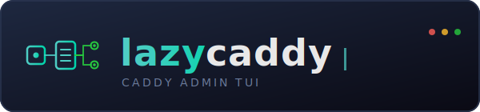

# LazyCaddy

<div align="center">
  
</div>

<div align="center">

[](LICENSE)
[](https://dotnet.microsoft.com/)
[]()

</div>

**A terminal UI for managing a running [Caddy](https://caddyserver.com/) server through its admin API, built on [SharpConsoleUI](https://github.com/nickprotop/ConsoleEx).**

<div align="center">

### ⭐ If you find LazyCaddy useful, please consider giving it a star! ⭐

It helps others discover the project and motivates continued development.

[](https://github.com/nickprotop/lazycaddy/stargazers)

</div>

LazyCaddy makes a running Caddy server easy to see and safe to change — without
living in its JSON config. It reads the live config to show your routes, their
handler chains, TLS certificates, and upstream health, and lets you make guided
edits that are always reversible. Every change is applied **all-or-nothing** and
snapshotted first, so nothing you do is one-way.

It runs right in your terminal — over SSH, no browser, no extra service to host.

**Inspect. Edit. Undo.**

## Highlights

- **See everything at a glance** — routes, handler chains, certs (with expiry
  warnings), live upstream health, traffic metrics, and a visual routing map.
- **Safe edits** — every change is applied as one atomic operation. If Caddy
  rejects it, the whole change rolls back and your server keeps running on the
  config it had. You see Caddy's own error, in plain language.
- **Undo anything** — every edit is snapshotted first. Press `U` to undo the last
  change, or browse and restore your full config history. Even restores are
  reversible.
- **Manage several Caddy servers** — switch between them instantly from one
  window (press `Ctrl+L`).
- **Find any action by name** — press `Ctrl+K` for a command palette; press `F1`
  for built-in help.
- **No setup** — a single binary, no database, no web port to secure.

## Quick Start

**Option 1: One-line install** (Linux, no .NET required)
```bash
curl -fsSL https://raw.githubusercontent.com/nickprotop/lazycaddy/master/install.sh | bash
lazycaddy
```

This installs the latest release binary to `~/.local/bin/lazycaddy`. Remove it with
`lazycaddy-uninstall.sh`, or grab a binary directly from the
[Releases](https://github.com/nickprotop/lazycaddy/releases) page.

**Option 2: Build from source** (requires .NET 10)
```bash
git clone https://github.com/nickprotop/lazycaddy.git
cd lazycaddy
./build-and-install.sh
```

## Usage

```bash
lazycaddy                                   # default: http://localhost:2019
lazycaddy --url https://caddy.host:2019     # point at a specific Caddy
lazycaddy --help                            # all options
```

With no arguments, LazyCaddy connects to the Caddy admin API at
`http://localhost:2019`. Pass `--url <URL>` (or a bare URL) to point somewhere
else for this session.

### Keys

| Key | Does |
|-----|------|
| `1`–`9` | Jump to a view |
| `Ctrl+K` | **Command palette** — find and run any action by name |
| `Ctrl+L` | **Switch server** |
| `F1` | **Help** |
| `R` | Refresh now |
| `U` | Undo the last change |
| `Shift+S` | Take a snapshot now |
| `Q` / `Esc` | Quit |

Tab and the arrow keys move around within a view.

### The command palette

Press `Ctrl+K` from anywhere to open a searchable list of every action — jump to
a view, refresh, undo, take a snapshot, switch server, open help, or run a
view-specific command like *Edit route match* or *Enable HTTPS*. Type to filter,
arrow keys to move, Enter to run. Actions that don't apply where you are show up
dimmed with a reason, so you always know what's available.

### Multiple servers

LazyCaddy can manage several Caddy servers from one window. List them in
`~/.config/lazycaddy/servers.json`:

```json
{
  "servers": [
    { "name": "prod",  "url": "http://localhost:2019" },
    { "name": "edge",  "url": "https://edge.internal:2019", "readOnly": true }
  ]
}
```

The active server shows in the top-right (`⚐ prod ▾`). Press `Ctrl+L` (or click
it) to open the server picker: switch instantly, or **Add / Manage** servers
right in the app — including a *Test connection* check before you save. Switching
re-points every view at the new server in place, with no restart, and each
server keeps its own separate snapshot history.

With no `servers.json`, LazyCaddy just uses the local default. A `--url` on the
command line is added as a temporary entry for that session (not saved). Mark a
server `"readOnly": true` to browse it with all edits disabled.

## Views

- **Overview** — status cards (Caddy health/version/uptime, route/cert/upstream
  counts) plus a request-rate sparkline and metrics (status codes, latency
  percentiles, busiest handlers) when traffic is flowing.
- **Routes** — a grouped, expandable table: each route is a row (host/match →
  upstream); expand it to see its full handler chain. Add/edit/delete routes,
  edit matchers, and add/reorder/remove handlers — including the security
  handlers (basic auth, header manipulation, IP access, forward-auth, rate-limit).
- **TLS / Certs** — domain, issuer, expiry, days-left (color-coded by urgency),
  ACME status, with an expiry-alert banner.
- **Upstreams** — active TCP reachability probe per upstream, with latency.
- **Raw Config** — the running config as line-numbered, syntax-highlighted JSON;
  find/replace, in-place editing via `/load`, and a Caddyfile→JSON adapter.
- **Snapshots** — every write auto-snapshots first; browse, pin, and restore
  config history (restores are themselves reversible).
- **Topology** — a scrollable routing graph: host → handler chain →
  upstream, health-colored, one swim-lane per route.
- **Logs** — a live tail of Caddy's access log.
- **Server** — server-level and global settings (listeners, automatic-HTTPS,
  TLS hardening).

## Edits are safe by design

Changing a live reverse proxy is nerve-wracking — so LazyCaddy is built so you
can't leave it half-broken:

- **Snapshot first.** Before any change, LazyCaddy saves the current config. Undo
  the last change with `U`, or restore any earlier point from the **Snapshots**
  view. Restores are snapshotted too, so even an undo is reversible.
- **All-or-nothing.** Each edit is applied as a single atomic operation. Either
  the whole change takes effect, or — if Caddy rejects it — nothing changes and
  your server keeps serving the config it already had. There's no partial,
  half-applied state.
- **Plain-language errors.** When Caddy refuses a change, you see its actual
  reason, cleaned up for reading.
- **See before you apply.** Edits show you a before/after diff and ask for
  confirmation.

Snapshots are kept separately per server under `~/.config/lazycaddy/snapshots/`
and survive restarts.

> **Heads up:** LazyCaddy edits a *real, running* Caddy. Try it against a test
> instance first, and only edit production once you trust a change. A server
> marked `"readOnly": true` in your `servers.json` disables all edits for safe
> browsing.

## Built on ConsoleEx

LazyCaddy's terminal interface — the windows, tables, the command palette, the
routing graph, syntax-highlighted JSON, and Markdown help — is powered by
[SharpConsoleUI](https://github.com/nickprotop/ConsoleEx), the author's own
console UI library.

## License

MIT — see [LICENSE](LICENSE).
